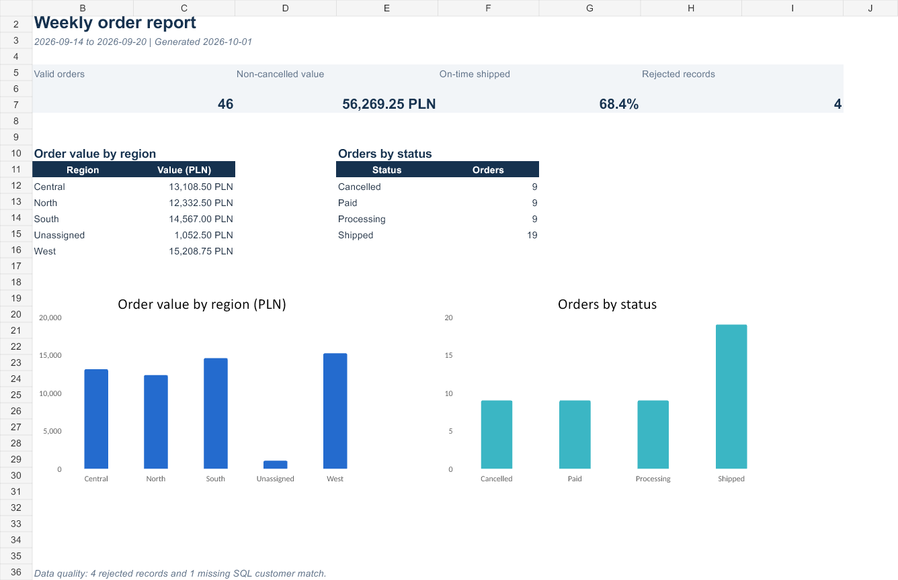
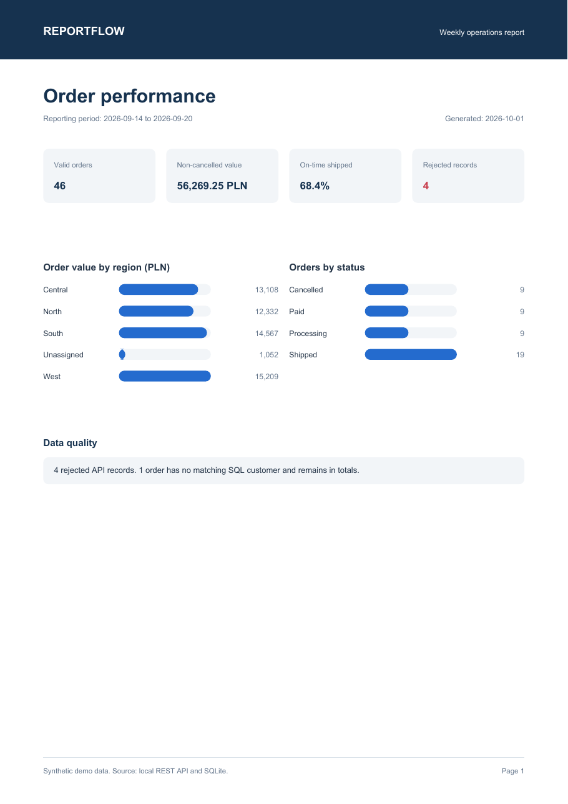

# ReportFlow

ReportFlow builds a weekly order report from a paginated API and a SQLite customer database. The demo includes a temporary API failure, invalid records and a missing database match, so the error paths are visible as well as the finished reports.



## What it does

One run:

1. reads 50 synthetic orders from two API pages;
2. retries page 2 after one `503` response;
3. rejects incomplete, duplicated or invalid records;
4. joins customer details from SQLite;
5. calculates four weekly KPIs;
6. writes a one-page PDF and a three-sheet Excel workbook.

```text
REST API -> validation -> SQLite join -> KPI calculation -> PDF and Excel
```

The demo produces 46 valid orders, 4 rejected records and 1 warning for an order without a matching SQL customer. The unmatched order remains in the non-cancelled order value.

## Example output

[Open the PDF report](examples/reportflow_report.pdf) | [Download the Excel workbook](examples/reportflow_report.xlsx)



The workbook contains:

- `Summary` - four KPIs and two breakdowns.
- `Orders` - validated and enriched order data.
- `Data quality` - rejected records and SQL warnings.

## Run the demo

Requirements: Python 3.11 or newer.

```powershell
python -m venv .venv
.venv\Scripts\python -m pip install -e ".[dev]"
.venv\Scripts\reportflow demo --output output
```

Generated files:

- `output/reportflow_report.pdf`
- `output/reportflow_report.xlsx`
- `output/reportflow.log`
- `output/reference.db`

## Test it

```powershell
.venv\Scripts\python -m pytest
```

The tests cover record validation, API pagination and retry, KPI calculations and the complete reporting pipeline.

## Reporting rules

- Invalid records never enter the KPIs.
- A missing SQL match creates a warning instead of silently removing the order.
- Cancelled orders stay in the detailed export but do not contribute to order value.
- Synthetic data stays deterministic, so results remain reproducible.

All names and records are synthetic. The repository contains no client data or production credentials.

For the business-focused overview, see [CASE_STUDY.md](CASE_STUDY.md).
